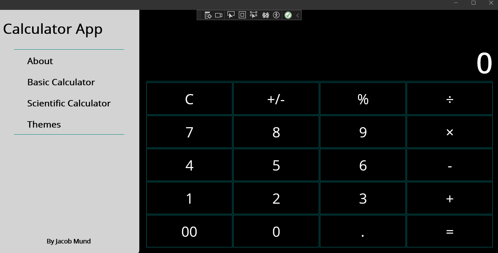
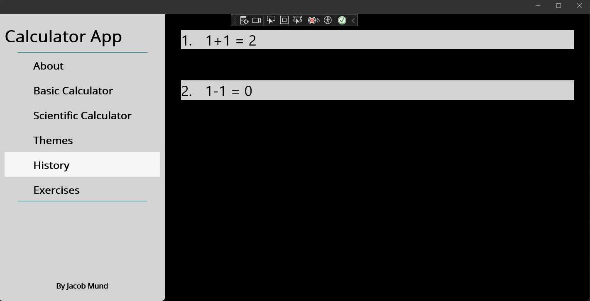
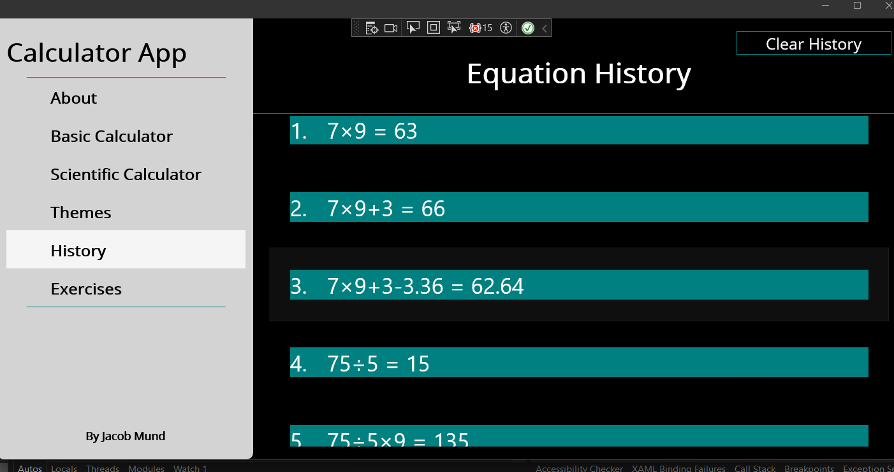

# CS797 Project - MAUI Calculator Expansion
## Introduction
This project is based off of the sample MAUI calculator app with added functionality and UI to support SQLite.

## Functionality
Added a "Scientific Calculator", now including operators such as: parenthesis, exponent, square root, and modulus.

A local database through the file system is created and used for persistant data collection and storage. This database is managed through SQLite, and equations entered by the user are stored in a flyout page titled "History".

A local API is used to generate math exercises, and then the MAUI app will connect to the API through a HTTP client and get the exercises from the database.
These exercises are displayed on their own flyout page, with three choices for answers, and a counter for overall score.

## Screenshots
### Scientific Calculator Interface

### Inital Flyout Page Template

### Final Flyout Page Layout

### API Generates Exercises

### Exercises Flyout Page

### Exercises Correct Display

## GitHub Info
Name: Jacob Mund

GitHub ID: 88554714

## Repository Overview Video
[Video Overview](https://youtu.be/7UtzvqaWRVY)
