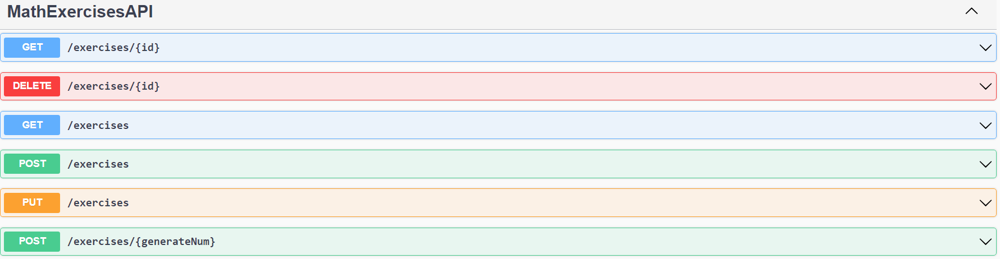
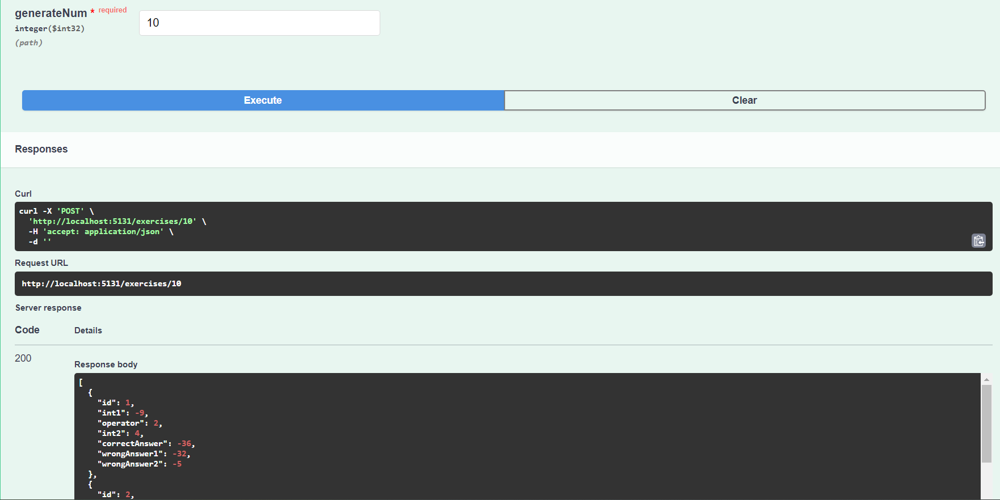
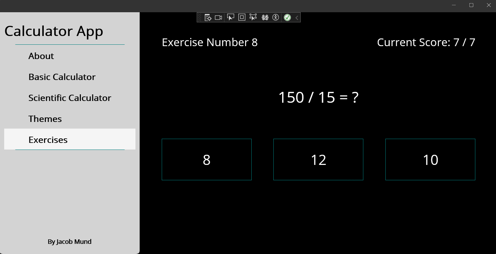
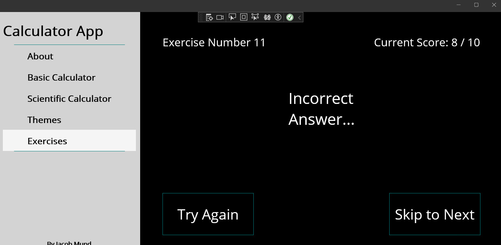
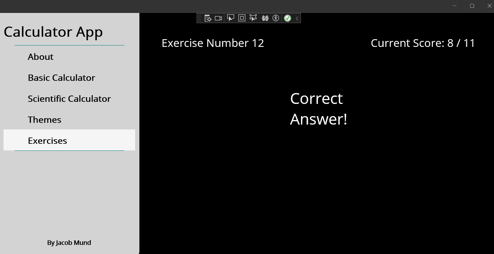

# CS797 Project 3 - API Connectivity
## Introduction
This project is based off of the sample MAUI calculator app with added functionality and UI.

## Functionality
A local API is used to generate math exercises, and then the MAUI app will connect to the API through a HTTP client and get the exercises from the database.

These exercises are displayed on their own flyout page, with three choices for answers, and a counter for overall score.

## Screenshots
### Initial API Creation

### API Generates Exercises

### Exercises Flyout Page

### Exercises Incorrect Display

### Exercises Correct Display

## GitHub Info
Name: Jacob Mund

GitHub ID: 88554714

## Repository Overview Video
[Video Overview](https://youtu.be/9AkwqRgQ7ug)